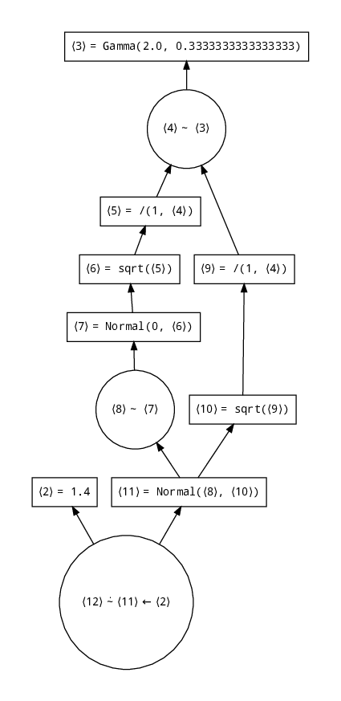

# AutoGibbs

[](https://travis-ci.com/phipsgabler/AutoGibbs.jl)

This was work for my thesis; it is no longer maintained and probably doesn't work in future versions of Julia or Turing.jl.

**Warning**

Beware: this is nothing but a proof of concept.  Specifically, due to unfortate choices in
`IRTracker**, handling traces of models with data sets not particularly small can lead to exploding
type inference time, making the method unusable in some cases.

Since keeping track with the internals of Turing that need to be traced, the implementation depends
on some fixed package versions.  To try it out, run from the environment defined in the
Manifest.toml.

There are some limitations with respect to kinds of observations supported: 
- Only “simple” indexing is allowed
- Slices may work, everything else is at your own risk
- Broadcasted sampling is not working


## Dependency extraction in DPPL models

The first thing this library does is to slice out dependency graphs of the random variables in a
[DynamicPPL](https://github.com/TuringLang/DynamicPPL.jl) model:

```julia
@model function test0(x)
    λ ~ Gamma(2.0, inv(3.0))
    m ~ Normal(0, sqrt(1 / λ))
    x ~ Normal(m, sqrt(1 / λ))
end

graph0 = trackdependencies(test0(1.4))
```

will result in 

```
⟨2⟩ = 1.4
⟨3⟩ = Gamma(2.0, 0.3333333333333333) → Gamma{Float64}(α=2.0, θ=0.3333333333333333)
⟨4⟩ = λ ~ ⟨3⟩ → 0.9881137307157533
⟨5⟩ = /(1, ⟨4⟩) → 1.0120292522153667
⟨6⟩ = sqrt(⟨5⟩) → 1.0059966462247112
⟨7⟩ = Normal(0, ⟨6⟩) → Normal{Float64}(μ=0.0, σ=1.0059966462247112)
⟨8⟩ = m ~ ⟨7⟩ → 1.0814646155873082
⟨9⟩ = /(1, ⟨4⟩) → 1.0120292522153667
⟨10⟩ = sqrt(⟨9⟩) → 1.0059966462247112
⟨11⟩ = Normal(⟨8⟩, ⟨10⟩) → Normal{Float64}(μ=1.0814646155873082, σ=1.0059966462247112)
⟨12⟩ = x ⩪ ⟨11⟩ ← ⟨2⟩
```

Notation: references to intermediate values are written in ⟨angle brackets⟩.  The names of random
variables in tilde statements are annotated with names (and possibly indices).  Unobserved random
variables (“assumptions”) are notated by a simple `~`, observed ones use `⩪`.  Equality signs denote
assignment of intermediate deterministic values, as in normal SSA-form IR.  The results of
deterministic or assumed values come after the `→`; `←` is used for values that are observed.

Numbers of references are quite contiguously numbered, but some numbers may be missing, since they
get removed by the slicing process.

The result of `trackdependencies` is a `Graph`, which is essentially an ordered dictionary from
`Reference`s to statements, that can be either of `Assumption`, `Observation`, `Call`, or
`Constant`.  For debugging, you can also use integers to index the graph:

```
julia> graph0[4]
λ ~ ⟨3⟩ → 0.9881137307157533
```

You can also write the graph to a GraphViz dot file:

```
julia> AutoGibbs.savedot("/tmp/graph.dot", graph0)
```

and covert it to PDF with

```
# Noto fonts are only required for fancy unicode, but otherwise some things will look ugly.
dot /tmp/graph.dot -Tpdf -Nfontname="Noto Mono" -Efontname="Noto Mono" > /tmp/graph.pdf
```




## Automatic extraction of Gibbs conditionals for discrete variables

The `StaticConditional(m, sym)` "pseudo-sampler" to use automatically extracted conditionals within
`Gibbs`.  This works by calculating the conditionals once on the model `m` for variable `sym`, and
reusing them in every sampling step; hence, the trace of the model must keep the same at every step.


```julia
julia> @model function test(x)
           w ~ Dirichlet(2, 1.0)
           p ~ DiscreteNonParametric([0.3, 0.7], w)
           x ~ Bernoulli(p)
       end
ModelGen{var"###generator#5702",(:x,),(),Tuple{}}(##generator#5702, NamedTuple())

julia> m = test(true);

julia> cond = StaticConditional(m, :p);

julia> cond.conditionals
Dict{VarName{:p,Tuple{}},AutoGibbs.GibbsConditional{VarName{:p,Tuple{}},AutoGibbs.LogLikelihood{DiscreteNonParametric{Float64,Float64,Array{Float64,1},Array{Float64,1}},UnionAll,Tuple{AutoGibbs.Fixed{Array{Float64,1}},AutoGibbs.Variable{VarName{:w,Tuple{}}}},AutoGibbs.Variable{VarName{:p,Tuple{}}}},Array{Pair{VarName,AutoGibbs.LogLikelihood},1}}} with 1 entry:
  p => logpdf(DiscreteNonParametric([0.3, 0.7], θ[w]), θ[p]) + logpdf(Bernoulli(θ[p]), θ[x])
```

In the last line, we see that the analytic log conditional density for `p`, in terms of the
variables in its Markov blanket.  This can then be normalized by summation (since `p` is discrete)
and sampled from exactly.

`StaticConditional(m, :x)` will sample the Gibbs conditional of discrete variables `x` with a
defined `Distributions.support` (assumed to be finite), or all such variables subsumed by `x` (i.e.,
`x[1]`, `x[2]`, ...).  Products (from `filldist` etc.) should work as well.

This sampler can then be used in combination with other samplers within `Gibbs`, for example:

```julia
julia> sample(m, Gibbs(cond, MH(:w)), N)
```

For models where relations between variables can vary dynamically, an equivalent sampler
`AutoConditional` is provided as well.  This sampler performs the graph extraction at every samling
step instead of once in advance.  Currently, however, it is only of theoretical interest, since due
to some typeing issues, it is incredibly slow.  Anyway:

```julia
sample(m, Gibbs(AutoConditional(:p), MH(:w)), N)
```

